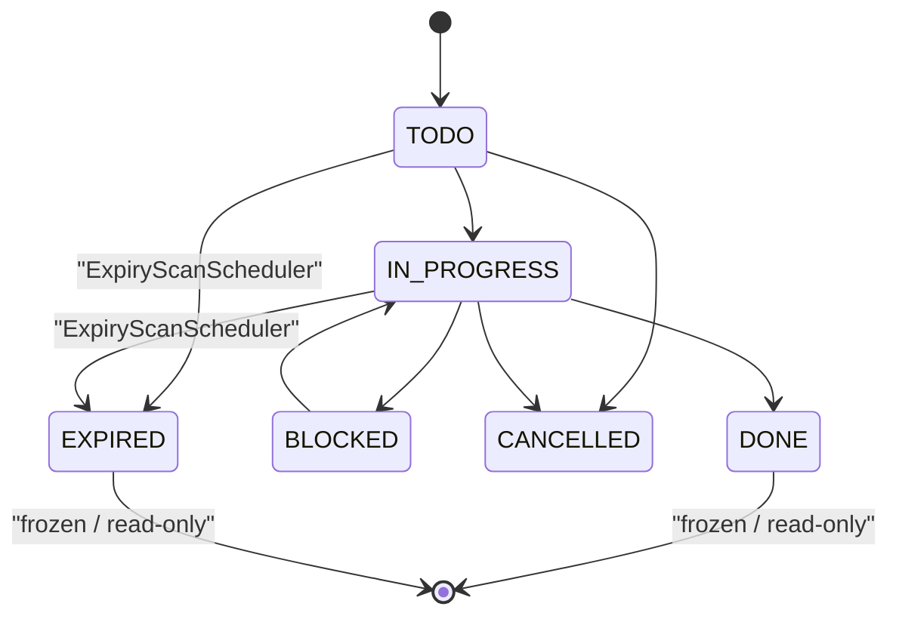
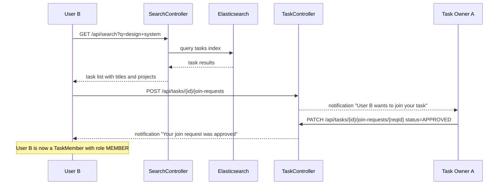
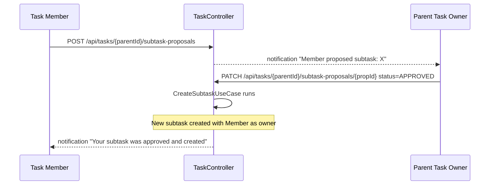
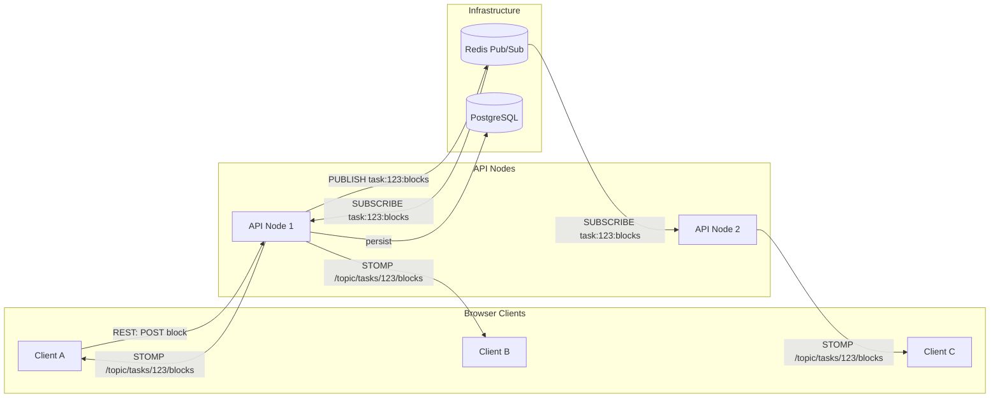
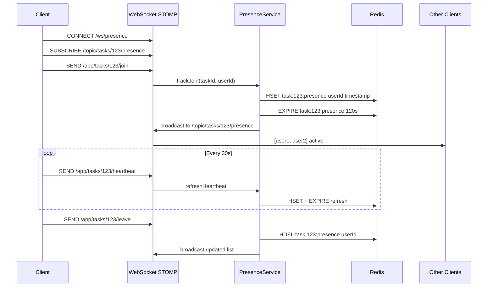
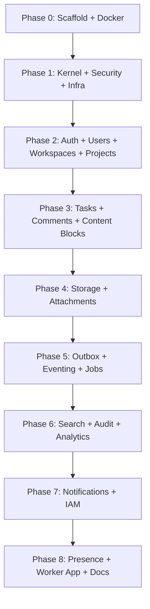

# Work Platform — Full Blueprint Implementation Plan

## Current State

The existing project at `utility-application/todo/` is a **single-module** Gradle project under `com.practice.todo` with:

- Spring Boot 4.0.5, Java 21, Spring Modulith, PostgreSQL, Kafka (configured but not running), MinIO (adapter exists), JobRunr
- 15 logical modules under `modules/` with partial hexagonal structure
- Docker Compose with only Postgres
- No Elasticsearch, No Redis, No WebSocket, No Comments module, No content blocks

## Target State

A **multi-module Gradle** project at `utility-application/work-platform/` under `com.example.workplatform` with:

- 2 deployable apps (`api-app`, `worker-app`)
- 4 shared libraries (`kernel`, `security`, `outbox`, `testing`)
- 15 business modules with full hexagonal layering (api/application/domain/infrastructure)
- 7 infrastructure modules (persistence, kafka, redis, elastic, storage, mail, observability)
- Docker Compose: Postgres + Kafka + Redis + Elasticsearch + MinIO
- Notion-like content blocks, WebSocket presence, global search with autocomplete

## Key Architectural Decisions

- **Root package**: `com.example.workplatform`
- **Gradle**: Multi-module with `settings.gradle` including all subprojects, each with own `build.gradle`
- **Domain purity**: Domain layer has zero Spring/JPA annotations; JPA entities live in `infrastructure/persistence` as separate mapper classes
- **Shared kernel**: `AggregateRoot`, `DomainEvent`, `Entity`, `ValueObject`, `ClockPort`, `IdGeneratorPort`
- **Content blocks**: New `modules/content/` module with `TaskBlock` entity (type: TEXT, HEADING, IMAGE, CODE, CHECKLIST, DIVIDER), ordered list, stored as JSON-backed blocks in Postgres
- **Presence**: New `modules/presence/` module using WebSocket (STOMP) + Redis Pub/Sub to track users viewing/editing a task in real-time
- **Search**: Elasticsearch with edge-ngram analyzer for autocomplete; `SearchIndexPort` abstraction

---

## Phase 0 — Project Scaffold

Create the multi-module Gradle structure and Docker Compose.

**Files to create:**

- `work-platform/settings.gradle` — includes all subprojects
- `work-platform/build.gradle` — root build with shared config, dependency management, Spring Boot BOM
- `work-platform/gradle.properties` — versions
- `work-platform/docker-compose.yml` — Postgres, Kafka (+ Zookeeper or KRaft), Redis, Elasticsearch, MinIO
- `work-platform/.env.example`
- `work-platform/README.md`

**Docker Compose services:**

```yaml
services:
  postgres: # 16-alpine, port 5432
  redis: # 7-alpine, port 6379
  kafka: # KRaft mode (bitnami/kafka), port 9092
  elasticsearch: # 8.x, port 9200
  minio: # latest, ports 9000/9001
```

**Gradle subproject layout:**

```
apps/api-app/build.gradle
apps/worker-app/build.gradle
shared/kernel/build.gradle
shared/security/build.gradle
shared/outbox/build.gradle
shared/testing/build.gradle
modules/auth/build.gradle
modules/users/build.gradle
modules/workspaces/build.gradle
modules/projects/build.gradle
modules/tasks/build.gradle
modules/comments/build.gradle
modules/content/build.gradle          # NEW: Notion-like blocks
modules/storage/build.gradle
modules/attachments/build.gradle
modules/notifications/build.gradle
modules/eventing/build.gradle
modules/jobs/build.gradle
modules/audit/build.gradle
modules/analytics/build.gradle
modules/search/build.gradle
modules/iam/build.gradle
modules/presence/build.gradle          # NEW: WebSocket presence
infrastructure/persistence/build.gradle
infrastructure/kafka/build.gradle
infrastructure/redis/build.gradle
infrastructure/elastic/build.gradle
infrastructure/storage/build.gradle
infrastructure/mail/build.gradle
infrastructure/observability/build.gradle
```

Each subproject's `build.gradle` declares only the dependencies it needs. Shared libraries are `java-library` plugins; apps are `spring-boot` plugins.

---

## Phase 1 — Shared Kernel + Security + Infrastructure Foundation

### shared/kernel

`com.example.workplatform.shared.kernel`

- `domain/`: `AggregateRoot<ID>` (with domain events list), `DomainEvent` interface (`eventId()`, `occurredAt()`, `eventType()`), `Entity<ID>`, `ValueObject`, `DomainException`, `BusinessRuleViolationException`
- `application/`: `Command`, `Query`, `UseCase`, `CommandHandler<C,R>`, `QueryHandler<Q,R>`, `ClockPort`, `IdGeneratorPort`, `TransactionRunner`
- `infrastructure/`: `SystemClockAdapter`, `UuidGeneratorAdapter`, `SpringTransactionRunner`
- `util/`: `JsonUtils`, `SlugUtils`

### shared/security

`com.example.workplatform.shared.security`

Port from existing `config/SecurityConfig.java`, `security/JwtAuthenticationFilter.java`, `security/JwtService.java`, etc. into:

- `SecurityConfiguration.java`, `MethodSecurityConfiguration.java`
- `JwtAuthenticationFilter.java`, `JwtAuthenticationEntryPoint.java`
- `CurrentUser.java` (annotation), `CurrentUserProvider.java`, `AuthenticatedUser.java`
- `SecurityConstants.java`

### infrastructure/persistence

- `JpaConfiguration.java`, `FlywayConfiguration.java`, JPA converters

### infrastructure/redis

- `RedisConfiguration.java` — Lettuce client, cache manager
- `CacheNames.java` — constant cache name strings
- `DistributedLockService.java` — Redisson or Spring Integration lock
- `RateLimitConfiguration.java`

### infrastructure/kafka

- `KafkaProducerConfiguration.java`, `KafkaConsumerConfiguration.java`
- `TopicNames.java`, `DeadLetterTopicConfiguration.java`, `KafkaHeaders.java`

### infrastructure/elastic

- `ElasticsearchClientConfiguration.java` — Java API Client
- `IndexNames.java`
- `SearchHealthIndicator.java`
- `SearchIndexInitializer.java` — creates indices on startup with mappings (edge-ngram for autocomplete)

### infrastructure/storage, mail, observability

- MinIO/S3 config, mail sender config, logging/metrics/tracing config

### apps/api-app

- `ApiApplication.java` — `@SpringBootApplication`
- `boot/`: `BootstrapConfiguration`, `JacksonConfiguration`, `ValidationConfiguration`, `OpenApiConfiguration`, `ModulithConfiguration`
- `web/`: `ApiExceptionHandler`, `ApiErrorResponse`, `PageResponse`, `RequestCorrelationFilter`
- `resources/application.yml` with profiles (`local`, `dev`, `prod`)

### Flyway migrations

All in `db/migration/`:

- `V001__create_users.sql` through `V013__create_analytics_projection_tables.sql`
- Port schema from existing 11 migrations, plus new tables for comments, content blocks, presence

---

## Phase 2 — Auth + Users + Workspaces + Projects

### modules/auth

Port from existing `modules/auth/` (hexagonal):

- `api/`: `AuthController`, `LoginRequest/Response`, `RegisterRequest`, `RefreshTokenRequest`, `MeResponse`
- `application/command/`: `LoginCommand`, `RegisterUserCommand`, `RefreshAccessTokenCommand`, `LogoutCommand`
- `application/service/`: `LoginUseCase`, `RegisterUserUseCase`, etc.
- `application/port/`: `PasswordHasherPort`, `TokenIssuerPort`, `RefreshTokenRepository`, `UserCredentialReader`
- `domain/model/`: `RefreshToken`, `AuthTokenPair`, `PasswordHash`
- `domain/event/`: `UserRegisteredEvent`, `UserLoggedInEvent`
- `infrastructure/persistence/`: `RefreshTokenJpaEntity`, `SpringDataRefreshTokenRepository`, adapter
- `infrastructure/security/`: `BCryptPasswordHasherAdapter`, `JwtTokenIssuerAdapter`

### modules/users

Port from existing `modules/user/`:

- Separate `User` domain model from `UserJpaEntity`
- Ports: `UserRepository`
- Events: `UserProfileUpdatedEvent`

### modules/workspaces

Port from existing `modules/workspace/`:

- Add `WorkspaceMember`, `WorkspaceRole` as first-class domain objects
- Ports: `WorkspaceRepository`, `WorkspaceMemberRepository`
- Policy: `WorkspaceAccessPolicy` (domain-level, not IAM)

### modules/projects

Port from existing `modules/project/`:

- `ProjectVisibility`, `ProjectRole`, `ProjectMember`
- Ports: `ProjectRepository`, `ProjectMemberRepository`, `WorkspaceLookupPort`
- Events: `ProjectCreatedEvent`, `ProjectArchivedEvent`, `ProjectMemberAddedEvent`

---

## Phase 3a — Tasks with Membership, Subtask Approval, and Freeze

### modules/tasks

The most complex module. Port hierarchy logic from existing project, plus new membership, approval, and freeze systems.

**Domain model:**

- `domain/model/`: `Task`, `TaskId`, `TaskPath`, `TaskStatus`, `TaskPriority`, `DueDate`, `SortOrder`, `TaskLabel`
- `domain/model/`: `TaskMember` (taskId, userId, role: OWNER/MEMBER, joinedAt) — who is part of this task
- `domain/model/`: `TaskJoinRequest` (id, taskId, requesterId, status: PENDING/APPROVED/REJECTED, message, requestedAt, decidedAt, decidedByUserId) — platform-wide task discovery + join
- `domain/model/`: `SubtaskProposal` (id, parentTaskId, proposerId, title, description, status: PROPOSED/APPROVED/REJECTED, proposedAt, decidedAt, decidedByUserId) — any member proposes, only parent task owner approves
- `domain/service/`: `TaskHierarchyService`, `TaskMovePolicy`, `TaskAssignmentPolicy`, `TaskCompletionPolicy`
- `domain/policy/`: `TaskFreezePolicy` — when status is DONE or EXPIRED, all mutations are rejected (blocks, comments, subtasks — view only)

**Task status lifecycle:**



**Task freeze rule**: When `task.status` is `DONE` or `EXPIRED`, `TaskFreezePolicy.assertNotFrozen(task)` is called at the top of every mutation use case (add block, edit block, add comment, propose subtask, join request). Only viewing is allowed.

**Task membership flow:**



**Subtask proposal flow:**

Any task member (including the owner) can propose a subtask. Only the **owner of the parent task** can approve it. Once approved, the subtask is created as a real `Task` with the proposer as its owner.



**Domain events:** `TaskCreatedEvent`, `SubtaskCreatedEvent`, `TaskUpdatedEvent`, `TaskMovedEvent`, `TaskCompletedEvent`, `TaskDeletedEvent`, `TaskLabelAddedEvent`, `TaskFrozenEvent`, `JoinRequestCreatedEvent`, `JoinRequestDecidedEvent`, `SubtaskProposalCreatedEvent`, `SubtaskProposalDecidedEvent`

**Application layer:**

- `application/command/`: CreateTask, UpdateTask, MoveTask, CompleteTask, DeleteTask, RestoreTask, AddLabel, RemoveLabel, RequestToJoinTask, DecideJoinRequest, ProposeSubtask, DecideSubtaskProposal
- `application/query/`: GetTaskById, GetTaskTree, ListProjectTasks, ListMyAssigned, ListTaskMembers, ListPendingJoinRequests, ListPendingSubtaskProposals
- `application/port/`: `TaskRepository`, `TaskTreeReadRepository`, `TaskMemberRepository`, `TaskJoinRequestRepository`, `SubtaskProposalRepository`, `ProjectMembershipPort`, `UserLookupPort`, `LabelRepository`
- Every mutation use case begins with: `TaskFreezePolicy.assertNotFrozen(task)` and `assertIsMember(userId, taskId)` (or `assertIsOwner` for approvals)

**Infrastructure:**

- `infrastructure/persistence/`: `TaskJpaEntity`, `TaskMemberJpaEntity`, `TaskJoinRequestJpaEntity`, `SubtaskProposalJpaEntity`, `TaskLabelJpaEntity`, Spring Data repos, adapters, mappers

**Migrations:**

`V005__create_tasks.sql`:

```sql
CREATE TABLE tasks (
    id UUID PRIMARY KEY,
    project_id UUID NOT NULL REFERENCES projects(id),
    parent_task_id UUID REFERENCES tasks(id),
    title VARCHAR(500) NOT NULL,
    status VARCHAR(32) NOT NULL DEFAULT 'TODO',
    priority VARCHAR(16) DEFAULT 'MEDIUM',
    due_at TIMESTAMPTZ,
    start_at TIMESTAMPTZ,
    sort_order INT NOT NULL DEFAULT 0,
    path VARCHAR(2000) NOT NULL,
    depth INT NOT NULL DEFAULT 0,
    version BIGINT NOT NULL DEFAULT 0,
    deleted_at TIMESTAMPTZ,
    created_at TIMESTAMPTZ NOT NULL DEFAULT now(),
    updated_at TIMESTAMPTZ NOT NULL DEFAULT now()
);

CREATE TABLE task_members (
    id UUID PRIMARY KEY,
    task_id UUID NOT NULL REFERENCES tasks(id) ON DELETE CASCADE,
    user_id UUID NOT NULL REFERENCES users(id),
    role VARCHAR(16) NOT NULL DEFAULT 'MEMBER',
    joined_at TIMESTAMPTZ NOT NULL DEFAULT now(),
    UNIQUE(task_id, user_id)
);

CREATE TABLE task_join_requests (
    id UUID PRIMARY KEY,
    task_id UUID NOT NULL REFERENCES tasks(id) ON DELETE CASCADE,
    requester_id UUID NOT NULL REFERENCES users(id),
    status VARCHAR(16) NOT NULL DEFAULT 'PENDING',
    message TEXT,
    requested_at TIMESTAMPTZ NOT NULL DEFAULT now(),
    decided_at TIMESTAMPTZ,
    decided_by_user_id UUID REFERENCES users(id)
);

CREATE TABLE subtask_proposals (
    id UUID PRIMARY KEY,
    parent_task_id UUID NOT NULL REFERENCES tasks(id) ON DELETE CASCADE,
    proposer_id UUID NOT NULL REFERENCES users(id),
    title VARCHAR(500) NOT NULL,
    description TEXT,
    status VARCHAR(16) NOT NULL DEFAULT 'PROPOSED',
    proposed_at TIMESTAMPTZ NOT NULL DEFAULT now(),
    decided_at TIMESTAMPTZ,
    decided_by_user_id UUID REFERENCES users(id)
);

CREATE TABLE task_labels (...);
CREATE INDEX idx_tasks_project_id ON tasks(project_id);
CREATE INDEX idx_tasks_path ON tasks(path);
CREATE INDEX idx_task_members_task ON task_members(task_id);
CREATE INDEX idx_task_members_user ON task_members(user_id);
CREATE INDEX idx_join_requests_task ON task_join_requests(task_id);
CREATE INDEX idx_subtask_proposals_parent ON subtask_proposals(parent_task_id);
```

---

## Phase 3b — Content Blocks + Block-Level Comments + Real-Time Collaboration

### modules/content (Collaborative append-only blocks)

Each task/subtask has a stream of content blocks. Blocks are **append-only** (always added at the end). Each block has an **owner** (the user who created it). Only the block owner can edit or delete their block. All other task members see it as read-only but can add comments on it.

**Domain model:**

- `domain/model/`: `TaskBlock` (id, taskId, ownerUserId, blockType, content as JSONB, sortOrder, createdAt, updatedAt, deletedAt), `BlockType` enum (TEXT, HEADING_1, HEADING_2, HEADING_3, BULLET_LIST, NUMBERED_LIST, CHECKLIST, CHECKLIST_ITEM, CODE, IMAGE, DIVIDER, QUOTE, CALLOUT)
- `domain/policy/`: `BlockOwnershipPolicy` — only `block.ownerUserId == currentUser` can edit/delete
- `domain/policy/`: `BlockFreezePolicy` — delegates to `TaskFreezePolicy`; if task is frozen, no block mutations
- `domain/event/`: `BlockAddedEvent`, `BlockUpdatedEvent`, `BlockDeletedEvent`

**Block ownership rule:**

```java
public class BlockOwnershipPolicy {
    public void assertCanMutate(TaskBlock block, UUID currentUserId) {
        if (!block.getOwnerUserId().equals(currentUserId)) {
            throw new BusinessRuleViolationException(
                "Only the block creator can edit or delete this block");
        }
    }
}
```

**Application layer:**

- `application/command/`: `AppendBlockCommand`, `UpdateBlockCommand`, `DeleteBlockCommand`
- `application/query/`: `ListTaskBlocksQuery`
- `application/port/`: `TaskBlockRepository`, `TaskMembershipLookupPort` (check caller is a task member), `ObjectStoragePort` (image uploads), `RealTimeBroadcastPort` (push to WebSocket)
- Every mutation: check `TaskFreezePolicy` -> check `TaskMembership` -> (for edit/delete) check `BlockOwnershipPolicy` -> persist -> broadcast via `RealTimeBroadcastPort`

**API layer (REST + WebSocket):**

REST endpoints for CRUD:

- `POST /api/tasks/{taskId}/blocks` — append a block (auto-assigns sortOrder = max+1, ownerUserId = currentUser)
- `PATCH /api/tasks/{taskId}/blocks/{blockId}` — edit (owner only)
- `DELETE /api/tasks/{taskId}/blocks/{blockId}` — soft delete (owner only)
- `GET /api/tasks/{taskId}/blocks` — list all blocks in order

WebSocket topics for near real-time:

- Subscribe: `/topic/tasks/{taskId}/blocks` — receives `BlockAddedEvent`, `BlockUpdatedEvent`, `BlockDeletedEvent`
- When any REST mutation succeeds, the use case publishes to `RealTimeBroadcastPort` which fans out via Redis Pub/Sub -> WebSocket STOMP broker -> all subscribed clients

**Infrastructure:**

- `infrastructure/persistence/`: `TaskBlockJpaEntity`, Spring Data repo, adapter
- `infrastructure/websocket/`: `BlockBroadcastService` implements `RealTimeBroadcastPort`, uses `SimpMessagingTemplate` to push to STOMP destinations
- `infrastructure/redis/`: `RedisBlockBroadcastAdapter` — for multi-instance fanout. When API runs on multiple nodes, the broadcasting node publishes to Redis Pub/Sub channel `task:{taskId}:blocks`, all nodes subscribe and forward to local WebSocket sessions.

**Migration `V014__create_task_blocks.sql`:**

```sql
CREATE TABLE task_blocks (
    id UUID PRIMARY KEY,
    task_id UUID NOT NULL REFERENCES tasks(id) ON DELETE CASCADE,
    owner_user_id UUID NOT NULL REFERENCES users(id),
    block_type VARCHAR(32) NOT NULL,
    content JSONB NOT NULL DEFAULT '{}',
    sort_order INT NOT NULL DEFAULT 0,
    created_at TIMESTAMPTZ NOT NULL DEFAULT now(),
    updated_at TIMESTAMPTZ NOT NULL DEFAULT now(),
    deleted_at TIMESTAMPTZ
);
CREATE INDEX idx_task_blocks_task_id ON task_blocks(task_id);
CREATE INDEX idx_task_blocks_owner ON task_blocks(owner_user_id);
```

The `content` JSONB stores block-type-specific data:

- TEXT: `{"text": "...", "marks": [{"type": "bold", "from": 0, "to": 5}]}`
- IMAGE: `{"objectKey": "...", "caption": "...", "width": 800}`
- CODE: `{"language": "java", "code": "..."}`
- CHECKLIST_ITEM: `{"text": "...", "checked": false}`

### modules/comments (Block-level threaded comments, unlimited nesting)

Comments attach to a specific **block** (not directly to a task). Threading uses **materialized path** for unlimited nesting depth (same approach as task hierarchy). Comments are also broadcast in near real-time via WebSocket.

**Domain model:**

- `domain/model/`: `Comment` (id, blockId, taskId, authorUserId, parentCommentId, body, path, depth, createdAt, updatedAt, deletedAt), `CommentId`, `CommentBody`
- `domain/policy/`: `CommentModificationPolicy` — only the comment author can edit/delete
- `domain/policy/`: `CommentFreezePolicy` — delegates to `TaskFreezePolicy`
- `domain/service/`: `CommentThreadingService` — computes path for new comments: root comment `path = segment(sortOrder)`, reply `path = parent.path + "." + segment(sortOrder)`
- `domain/event/`: `CommentAddedEvent`, `CommentUpdatedEvent`, `CommentDeletedEvent`

**Application layer:**

- `application/command/`: `AddCommentCommand` (blockId, parentCommentId nullable, body), `UpdateCommentCommand`, `DeleteCommentCommand`
- `application/query/`: `ListBlockCommentsQuery` (returns threaded tree), `GetCommentThreadQuery`
- `application/port/`: `CommentRepository`, `BlockLookupPort`, `TaskMembershipLookupPort`, `RealTimeBroadcastPort`
- Every mutation: check `TaskFreezePolicy` -> check `TaskMembership` -> (for edit/delete) check `CommentModificationPolicy` -> persist -> broadcast via `RealTimeBroadcastPort`

**API layer (REST + WebSocket):**

REST endpoints:

- `POST /api/tasks/{taskId}/blocks/{blockId}/comments` — add root comment on a block
- `POST /api/tasks/{taskId}/blocks/{blockId}/comments/{commentId}/replies` — add nested reply
- `PATCH /api/tasks/{taskId}/comments/{commentId}` — edit (author only)
- `DELETE /api/tasks/{taskId}/comments/{commentId}` — soft delete (author only)
- `GET /api/tasks/{taskId}/blocks/{blockId}/comments` — threaded comment tree for a block

WebSocket topics:

- Subscribe: `/topic/tasks/{taskId}/comments` — receives `CommentAddedEvent`, `CommentUpdatedEvent`, `CommentDeletedEvent`
- Same multi-instance fanout via Redis Pub/Sub as blocks

**Infrastructure:**

- `infrastructure/persistence/`: `CommentJpaEntity`, Spring Data repo with materialized-path queries (`findByBlockIdOrderByPath`), adapter
- `infrastructure/websocket/`: `CommentBroadcastService` implements `RealTimeBroadcastPort`
- `infrastructure/redis/`: `RedisCommentBroadcastAdapter` — multi-instance fanout via Redis Pub/Sub channel `task:{taskId}:comments`

**Migration `V015__create_comments.sql`:**

```sql
CREATE TABLE comments (
    id UUID PRIMARY KEY,
    block_id UUID NOT NULL REFERENCES task_blocks(id) ON DELETE CASCADE,
    task_id UUID NOT NULL REFERENCES tasks(id),
    author_user_id UUID NOT NULL REFERENCES users(id),
    parent_comment_id UUID REFERENCES comments(id),
    body TEXT NOT NULL,
    path VARCHAR(2000) NOT NULL,
    depth INT NOT NULL DEFAULT 0,
    created_at TIMESTAMPTZ NOT NULL DEFAULT now(),
    updated_at TIMESTAMPTZ NOT NULL DEFAULT now(),
    deleted_at TIMESTAMPTZ
);
CREATE INDEX idx_comments_block_id ON comments(block_id);
CREATE INDEX idx_comments_task_id ON comments(task_id);
CREATE INDEX idx_comments_path ON comments(path);
CREATE INDEX idx_comments_parent ON comments(parent_comment_id);
```

### Real-time collaboration architecture

The near real-time system uses a layered approach:



**Flow for a block append:**

1. Client A sends `POST /api/tasks/{taskId}/blocks` (REST)
2. `AppendBlockUseCase` checks freeze -> membership -> persists to Postgres -> calls `RealTimeBroadcastPort.broadcastBlockAdded(event)`
3. `RedisBlockBroadcastAdapter` publishes to Redis Pub/Sub channel `task:{taskId}:blocks`
4. All API nodes subscribed to that channel receive the event
5. Each node uses `SimpMessagingTemplate` to push to `/topic/tasks/{taskId}/blocks` for locally-connected WebSocket clients
6. All clients (A, B, C) receive the `BlockAddedEvent` in near real-time

Same flow applies for block edits, block deletes, comment adds, comment edits, comment deletes.

**Shared port interface:**

`

`

`

`

`

`

`

`

`

`

`

`

`

`

`

`

`

`

`

`

`

`

`

`

`

`

`

`

`

`

`

`

`

`

`

`

`

`

`

`

`

`

`

`

`

`

`

`

`

`

`

`

`

`

`

`

`

`

`

`

`

`

`

`

`

`

`

`

`

`

`

`

`

`

`

`

`

`

`

`

`

`

`

`

`

`

`

`

`

`

`

`

`

`

`

`

`

`

`

`

`

`

`

`

`

`

`

`

`

`

`

`

`

`

`

`

`

`

`

`

`

`

`

`

`

`

`

`

`

`

`

`

`

`

`

`

`

`

`

`

`

`

`

`

`

`

`

`

`

`

`

`

`

`

`

`

`

`

`

`

`

`

`

`

`

`

`

`

`

`

`

`

`

`

`

`

`

`

`

`

`

`

`

`

`

`

`

`

`

`

`

`

`

`

`

`

`

`

`

`

`

`

`

`

`

`

`

`

`

`

`

`

`

`

`

`

`

`

`

`

`

`

`

`

`

`

`

`

`

`

`

`

`

`

`

`

`

`

`

`

`

`

`

`

`

`

`

`

`

`

`

`

`

`

`

`

`

`

`

`

`

`

`

`

`

`

`

`

`

`

`

`

`

`

`

`

`

`

`

`

`

`

`

`

`

`

`

`

`

`

`

`

`

`

`

`

`

`

`

`

`

`

`

`

`

`

`

`

`

`

`

`

`

`

`

`

`

`

`

`

`

`

`

`

`

`

`

`

`

`

`

`

`

`

`

`

`

`

`

`

`

`

`

`

`

`

`

`

`

`

`

`

`

`

`

`

`

`

`

`

`

`

`

`

`

`

`

`

`

`

`

`

`

`

`

`

`

`

`

`

`

`

`

`

`

`

`

`

`

`

`

`

`

`

`

`

`

`

`

`

`

`

`

`

`

`

`

`

`

`

`

`

`

`

`

`

`

`

`

`

`

`

`

`

`

`

`

`

`

`

`

`

`

`

`

`

`

`

`

`

`

`

`

`

`

`

`

`

`

`

`

`

`

`

`

`

`

`

`

`

`

`

`

`

`

`

`

`

`

`

`

`

`

`

`

`

`

`

`

`

`

`

`

`

`

`

`

`

`

`

`

`

`

`

`

`

`

`

`

`

`

`

`

`

`

`

`

`

`

`

`

`

`

`

`

`

`

`

`

`

`

`

`

`

`

`

`

`

`

`

`

`

`

`

`

`

`

`

`

`

`

`

`

`

`

`

`

`

`

`

`

`

`

`

`

`

`

`

`

`

`

`

`

`

`

`

`

`

`

`

`

`

`

`

`

`

`

`

`

`

`

`

`

`

`

`

`

`

`

`

`

`

`

`

`

`

`

`

`

`

`

`

`

`

`

`

`

`

`

`

`

`

`

`

`

`

`

`

`

`

`

`

`

`

`

`

`

`

`

`

`

`

`

`

`

`

`

````java
public interface RealTimeBroadcastPort {
    void broadcastBlockAdded(UUID taskId, BlockAddedEvent event);
    void broadcastBlockUpdated(UUID taskId, BlockUpdatedEvent event);
    void broadcastBlockDeleted(UUID taskId, BlockDeletedEvent event);
    void broadcastCommentAdded(UUID taskId, CommentAddedEvent event);
    void broadcastCommentUpdated(UUID taskId, CommentUpdatedEvent event);
    void broadcastCommentDeleted(UUID taskId, CommentDeletedEvent event);
}

---

## Phase 4 — Storage + Attachments

### modules/storage

Port from existing `modules/storage/`:

- `application/port/`: `ObjectStoragePort` interface
- `infrastructure/local/`: `LocalObjectStorageAdapter`
- `infrastructure/s3/`: `S3ObjectStorageAdapter` (using MinIO client)
- `infrastructure/factory/`: `StorageStrategyFactory`

### modules/attachments

Port from existing `modules/attachment/`:

- Add `AttachmentChecksum`, `AttachmentMimeType` value objects
- Policy: `AttachmentAccessPolicy`
- Events: `AttachmentUploadedEvent`, `AttachmentDeletedEvent`

---

## Phase 5 — Outbox + Eventing + Jobs

### shared/outbox

Port from existing `modules/eventing/` outbox classes:

- `OutboxEvent`, `OutboxEventStatus`, `OutboxEventRepository`, `OutboxEventPublisherPort`
- `OutboxRelayScheduler` with exponential backoff retry
- `OutboxEventMapper`

### modules/eventing

- `application/port/`: `IntegrationEventPublisherPort`, `EventSerializerPort`
- `domain/model/`: `IntegrationEvent`, `EventEnvelope`, `EventTopic`
- `infrastructure/kafka/`: `KafkaIntegrationEventPublisherAdapter`, consumers per module
- `infrastructure/outbox/`: `OutboxRelayJob`, `OutboxToIntegrationEventMapper`

### modules/jobs

Port from existing `modules/jobs/`:

- `application/port/`: `JobQueuePort`
- `infrastructure/jobrunr/`: `JobRunrJobQueueAdapter`
- `infrastructure/redisstreams/`: `RedisStreamsJobQueueAdapter`, `RedisStreamJobPublisher`, `RedisStreamJobConsumer`
- `infrastructure/inmemory/`: `InMemoryJobQueueAdapter` (for tests)
- `infrastructure/handler/`: `ReminderJobHandler`, `EmailDeliveryJobHandler`, `SearchReindexJobHandler`, `AttachmentProcessingJobHandler`

### apps/worker-app

- `WorkerApplication.java` — separate Spring Boot app for background processing
- Consumes from Kafka topics, runs scheduled jobs

---

## Phase 6 — Search (Elasticsearch) + Audit + Analytics

### modules/search

Replace existing JPQL-based search with Elasticsearch:

- `application/port/`: `SearchIndexPort` — `upsertTask()`, `upsertProject()`, `deleteTask()`, `search()`, `autocomplete()`
- `domain/model/`: `SearchDocument`, `TaskSearchDocument`, `ProjectSearchDocument`, `SearchQuery`, `SearchResult`
- `api/`: `SearchController` — `GET /api/search?q=&type=&workspaceId=` and `GET /api/search/autocomplete?q=`
- `infrastructure/elastic/`: `ElasticsearchSearchAdapter` implementing `SearchIndexPort`
  - Uses edge-ngram analyzer on `title` field for autocomplete
  - Supports multi-index search (tasks + projects)
- `infrastructure/consumer/`: `TaskSearchProjectionConsumer`, `ProjectSearchProjectionConsumer`, `CommentSearchProjectionConsumer`

**Elasticsearch index mapping (tasks):**

```json
{
  "settings": {
    "analysis": {
      "analyzer": {
        "autocomplete_analyzer": {
          "type": "custom",
          "tokenizer": "standard",
          "filter": ["lowercase", "autocomplete_filter"]
        }
      },
      "filter": {
        "autocomplete_filter": {
          "type": "edge_ngram",
          "min_gram": 2,
          "max_gram": 20
        }
      }
    }
  },
  "mappings": {
    "properties": {
      "title": {
        "type": "text",
        "analyzer": "autocomplete_analyzer",
        "search_analyzer": "standard"
      },
      "description": { "type": "text" },
      "status": { "type": "keyword" },
      "projectId": { "type": "keyword" },
      "workspaceId": { "type": "keyword" },
      "assigneeUserId": { "type": "keyword" },
      "labels": { "type": "keyword" },
      "createdAt": { "type": "date" }
    }
  }
}
`

`

`

`

`

`

`

`

`

`

`

`

`

`

`

`

`

`

`

`

`

`

`

`

`

`

`

`

`

`

`

`

`

`

`

`

`

`

`

`

`

`

`

`

`

`

`

`

`

`

`

`

`

`

`

`

`

`

`

`

`

`

`

`

`

`

`

`

`

`

`

`

`

`

`

`

`

`

`

`

`

`

`

`

`

`

`

`

`

`

`

`

`

`

`

`

`

`

`

`

`

`

`

`

`

`

`

`

`

`

`

`

`

`

`

`

`

`

`

`

`

`

`

`

`

`

`

`

`

`

`

`

`

`

`

`

`

`

`

`

`

`

`

`

`

`

`

`

`

`

`

`

`

`

`

`

`

`

`

`

`

`

`

`

`

`

`

`

`

`

`

`

`

`

`

`

`

`

`

`

`

`

`

`

`

`

`

`

`

`

`

`

`

`

`

`

`

`

`

`

`

`

`

`

`

`

`

`

`

`

`

`

`

`

`

`

`

`

`

`

`

`

`

`

`

`

`

`

`

`

`

`

`

`

`

`

`

`

`

`

`

`

`

`

`

`

`

`

`

`

`

`

`

`

`

`

`

`

`

`

`

`

`

`

`

`

`

`

`

`

`

`

`

`

`

`

`

`

`

`

`

`

`

`

`

`

`

`

`

`

`

`

`

`

`

`

`

`

`

`

`

`

`

`

`

`

`

`

`

`

`

`

`

`

`

`

`

`

`

`

`

`

`

`

`

`

`

`

`

`

`

`

`

`

`

`

`

`

`

`

`

`

`

`

`

`

`

`

`

`

`

`

`

`

`

`

`

`

`

`

`

`

`

`

`

`

`

`

`

`

`

`

`

`

`

`

`

`

`

`

`

`

`

`

`

`

`

`

`

`

`

`

`

`

`

`

`

`

`

`

`

`

`

`

`

`

`

`

`

`

`

`

`

`

`

`

`

`

`

`

`

`

`

`

`

`

`

`

`

`

`

`

`

`

`

`

`

`

`

`

`

`

`

`

`

`

`

`

`

`

`

`

`

`

`

`

`

`

`

`

`

`

`

`

`

`

`

`

`

`

`

`

`

`

`

`

`

`

`

`

`

`

`

`

`

`

`

`

`

`

`

`

`

`

`

`

`

`

`

`

`

`

`

`

`

`

`

`

`

`

`

`

`

`

`

`

`

`

`

`

`

`

`

`

`

`

`

`

`

`

`

`

`

`

`

`

`

`

`

`

`

`

`

`

`

`

`

`

`

`

`

`

`

`

`

`

`

`

`

`

`

`

`

`

`

`

`

`

`

`

`

`

`

`

`

`

`

`

`

`

`

`

`

`

`

`

`

`

`

`

`

`

`

`

`

`

`

`

`

`

`

`

`

`

`

`

`

`

`

`

`

`

`

`

`

`

`

`

`

`

`

`

`

`

`

`

`

`

`

`

`

`

`

`

`

`

`

````

### modules/audit

Port from existing `modules/audit/`:

- Add proper `AuditEventNormalizer` for consistent event-to-log mapping
- Kafka consumers per entity type

### modules/analytics

Port from existing `modules/analytics/`:

- Add projection handlers for task created/completed/overdue

---

## Phase 7 — Notifications + IAM

### modules/notifications

Port from existing `modules/notification/`:

- Channel strategy: `EmailNotificationStrategy`, `InAppNotificationStrategy`
- Templates: `TaskAssignedTemplate`, `TaskReminderTemplate`, `ProjectInviteTemplate`
- Job-based delivery via `JobQueuePort`

### modules/iam

Port from existing `modules/iam/`:

- Policies: `CanEditTaskPolicy`, `CanMoveTaskPolicy`, `CanManageProjectMembersPolicy`, `CanUploadAttachmentPolicy`
- Ports: `WorkspaceRoleLookupPort`, `ProjectRoleLookupPort`, `TaskAssignmentLookupPort`
- `AuthorizationPolicyRegistry` for centralized policy lookup

---

## Phase 8 — Presence (WebSocket + Redis) + Documentation

### modules/presence (NEW)

Real-time presence tracking for tasks:

- `domain/model/`: `PresenceEntry` (userId, taskId, joinedAt, lastHeartbeat), `PresenceEvent` (JOIN, LEAVE, HEARTBEAT)
- `application/port/`: `PresenceStore` (interface backed by Redis)
- `application/service/`: `TrackPresenceUseCase`, `GetTaskPresenceUseCase`
- `api/`: WebSocket STOMP endpoint at `/ws/presence`
  - Subscribe to `/topic/tasks/{taskId}/presence` — receives list of active users
  - Send to `/app/tasks/{taskId}/join`, `/app/tasks/{taskId}/leave`, `/app/tasks/{taskId}/heartbeat`
- `infrastructure/redis/`: `RedisPresenceAdapter` using Redis Hash (`task:{taskId}:presence` -> userId -> timestamp) with TTL-based expiry for stale sessions
- `infrastructure/websocket/`: `WebSocketConfiguration`, `PresenceWebSocketHandler`

**Dependencies**: `spring-boot-starter-websocket`, `spring-boot-starter-data-redis`

**Flow:**



### Documentation

- `docs/architecture/01-system-overview.md` through `08-deployment-topology.md`
- `docs/api/openapi.yaml`
- `db/seed/local-seed.sql`, `db/seed/demo-seed.sql`

---

## Task Lifecycle and Content Model

Every task and subtask supports the full lifecycle:

- **Status flow**: `TODO` -> `IN_PROGRESS` -> `DONE` | `BLOCKED` | `CANCELLED`
- **Expiry**: `ExpiryScanScheduler` detects overdue tasks and transitions to `EXPIRED` status, fires `TaskDueExpiredEvent`
- **Subtasks**: Unlimited depth via materialized path. Creating a subtask under a task (or another subtask) computes `path = parent.path + "." + segment(sortOrder)`
- **Content blocks (Notion-like)**: Under any task or subtask, users can add/reorder/delete content blocks. Each block has a type (TEXT, HEADING, IMAGE, CODE, CHECKLIST, etc.) and JSONB content. Images are uploaded via `ObjectStoragePort` and referenced by `objectKey` in the block content.
- **Status cascade**: `TaskCompletionPolicy` enforces that a parent task cannot be marked DONE if it has incomplete subtasks

**Task status enum:**

```java
public enum TaskStatus {
    TODO, IN_PROGRESS, DONE, BLOCKED, CANCELLED, EXPIRED
}
```

---

## User Online Status (part of modules/presence)

The presence module handles both **task-level** and **user-level** presence:

- **Task presence**: Who is currently viewing/editing a specific task (WebSocket + Redis Hash per task)
- **User online status**: Global online/offline/away tracking via Redis Sorted Set (`user:online` -> userId -> lastHeartbeat timestamp). Users send periodic heartbeats; a scheduled cleanup marks stale entries as offline.
- **User search with status**: `modules/users` exposes `GET /api/users/search?q=&workspaceId=` which returns user profiles enriched with online/offline status from the presence module via `UserPresencePort`

This enables the "search users and see who's online" feature without needing Cassandra (Redis is sufficient for presence at this scale).

---

## Future Feature: 1v1 Chat (Not in Current Scope)

The following feature is explicitly **deferred to a future phase** and is NOT part of this build:

- **1v1 real-time chat** between users
- **Message persistence** with Cassandra (or ScyllaDB) for high-volume, write-heavy message storage
- **Message search** (Elasticsearch over chat messages)
- **Chat presence** (typing indicators, read receipts)
- **Chat notification integration** (push notifications for new messages)

**Why deferred**: Chat requires a fundamentally different data model (wide-column store for messages, separate WebSocket channels per conversation, fanout patterns). It should be built as a separate `modules/chat/` module after the core platform is stable. The architecture already supports this extension — the `PresenceStore` port, `WebSocketConfiguration`, `JobQueuePort`, and `NotificationSenderPort` are all reusable foundations for chat.

**Planned future module structure:**

```
modules/chat/
├── api/         # ChatController, ConversationController
├── application/ # SendMessageUseCase, ListConversationsUseCase, SearchMessagesUseCase
├── domain/      # Conversation, Message, MessageStatus, ReadReceipt
├── infrastructure/
│   ├── cassandra/  # CassandraMessageRepository (write-optimized)
│   ├── elastic/    # ElasticsearchChatSearchAdapter
│   └── websocket/  # ChatWebSocketHandler
```

---

## Design Patterns and SOLID Principles Applied

| Pattern                            | Where Applied                                                                                                                            | Purpose                                                                   |
| ---------------------------------- | ---------------------------------------------------------------------------------------------------------------------------------------- | ------------------------------------------------------------------------- |
| **Strategy**                       | `StorageStrategyFactory` (local/S3/MinIO), `NotificationChannelStrategy` (email/in-app/Slack), `JobQueueAdapter` (JobRunr/Redis Streams) | Swap implementations at runtime via config without changing callers (OCP) |
| **Factory**                        | `StorageStrategyFactory`, `JobQueueStrategyFactory`, `NotificationSenderFactory`                                                         | Encapsulate adapter creation and selection logic                          |
| **Adapter**                        | Every `*Adapter.java` in `infrastructure/` layers                                                                                        | Bridge between domain ports and external systems (DIP)                    |
| **Repository**                     | Domain ports (`TaskRepository`, `UserRepository`, etc.) implemented by JPA adapters                                                      | Abstract persistence from domain (DIP, ISP)                               |
| **Ports and Adapters (Hexagonal)** | Every module: domain defines ports, infrastructure implements them                                                                       | Domain remains framework-independent                                      |
| **Outbox**                         | `shared/outbox/` + `modules/eventing/`                                                                                                   | Reliable at-least-once event delivery without distributed transactions    |
| **Domain Events**                  | `AggregateRoot.registerEvent()` -> outbox -> Kafka -> consumers                                                                          | Decouple side effects from main transaction (SRP)                         |
| **Command/Query Separation**       | `*Command.java` / `*Query.java` objects, separate `*UseCase` services                                                                    | Clear read/write separation (SRP)                                         |
| **Policy/Specification**           | `TaskMovePolicy`, `TaskCompletionPolicy`, `CommentModificationPolicy`, IAM policies                                                      | Externalize business rules from use cases (SRP, OCP)                      |
| **Template Method**                | `AggregateRoot<ID>` base class                                                                                                           | Common event registration behavior across all aggregates                  |

**SOLID compliance:**

- **S (Single Responsibility)**: Each use case class does one thing; policies are separate from services
- **O (Open/Closed)**: New storage providers, notification channels, job adapters added without modifying existing code
- **L (Liskov Substitution)**: All port implementations are interchangeable (LocalStorage vs S3, JobRunr vs RedisStreams)
- **I (Interface Segregation)**: Ports are narrow (`ObjectStoragePort`, `SearchIndexPort`, `PresenceStore`) — callers depend only on what they need
- **D (Dependency Inversion)**: Domain/application depend on port interfaces; infrastructure provides implementations

---

## Additions Not in User's Original Blueprint

| Feature                        | Module                   | Key Details                                                                                                              |
| ------------------------------ | ------------------------ | ------------------------------------------------------------------------------------------------------------------------ |
| **Notion-like content blocks** | `modules/content/`       | `TaskBlock` with JSONB content, block types (TEXT, HEADING, IMAGE, CODE, CHECKLIST, etc.), ordered list per task/subtask |
| **Task presence (WebSocket)**  | `modules/presence/`      | STOMP over WebSocket + Redis Hash for tracking who is on a task in real-time                                             |
| **User online/offline status** | `modules/presence/`      | Redis Sorted Set for global user online status, exposed via user search endpoint                                         |
| **Autocomplete search**        | `modules/search/`        | Elasticsearch edge-ngram analyzer on title fields, dedicated `/api/search/autocomplete` endpoint                         |
| **1v1 Chat**                   | _Future_ `modules/chat/` | Deferred — Cassandra-backed messaging, WebSocket channels, search. Foundations (presence, WS, jobs) are reusable.        |

---

## Implementation Order (Recommended)


