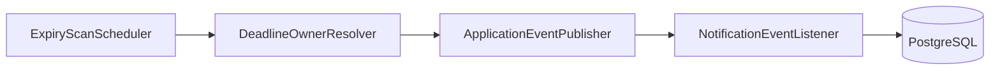

# Production-grade Todo Backend — Implementation Plan

This document is the authoritative plan for evolving [`utility-application/todo`](.) from a Spring Boot scaffold into a production-oriented API: onboarding, JWT auth, projects, recursive text-only tasks/subtasks, effective due dates, in-process domain events, scheduled expiry handling, and deduplicated notifications.

---

## 1. Goals

- **Onboarding**: user can mark onboarding complete (persisted flag/timestamp).
- **Authentication**: JWT access token + refresh token (stored hashed, rotation on refresh); password hashing (BCrypt); Spring Security filter chain.
- **Domain**: user owns **projects**; each project has a tree of **tasks** (adjacency list `parent_task_id`); task body is **text only** (title + optional text content).
- **Time / deadlines**:
  - Project may have **`timeline_end_at`** (project-level deadline).
  - Task/subtask may have optional **`due_at`**; if null, **effective due** inherits from parent; root inherits **`timeline_end_at`** when its own `due_at` is null.
- **Events**: domain events for expiry/timeline (Spring `ApplicationEventPublisher` + listeners); **scheduled job** finds overdue anchors and publishes events.
- **Notifications**: persist in DB; **no duplicate spam** for inherited deadlines — notify at the **deadline owner** only (explicit task due or project timeline), per user brief.
- **Quality bar**: invariants (no cycles, same project for parent/child, transactional writes), indexes for access patterns, Flyway migrations, `ddl-auto: validate`.

---

## 2. Stack choices

| Concern | Choice | Notes |
|--------|--------|--------|
| Database | **PostgreSQL** | Local via Docker Compose; Flyway for schema. |
| Messaging | **In-process Spring events + `@Scheduled`** | Sufficient for MVP; optional later: outbox table + Kafka. |
| Task tree | **Adjacency list** | `parent_task_id` nullable; evolve to path/closure only if read patterns demand it. |
| REST | **Explicit `@RestController`** | Remove `spring-boot-starter-data-rest` to keep JWT and error handling explicit. |

---

## 3. Data model

### 3.1 Entities / tables

- **`users`**: `id` (UUID), `email` (unique), `password_hash`, `display_name`, `onboarding_completed_at` (nullable timestamptz), `created_at`, `updated_at`.
- **`refresh_tokens`**: `id`, `user_id` (FK), `token_hash`, `expires_at`, `revoked` (bool), `created_at`; index on `(user_id, revoked)`.
- **`projects`**: `id`, `user_id` (FK), `name`, `description`, `timeline_end_at` (nullable), `created_at`, `updated_at`.
- **`tasks`**: `id`, `project_id` (FK), `parent_task_id` (nullable, self-FK → `tasks.id`), `title`, `content` (text), `status` (enum: e.g. `TODO`, `IN_PROGRESS`, `DONE`), `due_at` (nullable), `sort_order` (int), `deleted_at` (nullable, soft delete), `created_at`, `updated_at`.

**Indexes (initial)**:

- `(project_id, parent_task_id, sort_order)` — list children / roots.
- `(parent_task_id)` — parent lookups.
- `(project_id)` — project-scoped queries.
- `(user_id)` on projects — ownership.
- `(due_at)` where `deleted_at IS NULL` — optional helper for scans (logic still uses effective due).

### 3.2 Optional: `project_events` (timeline audit)

Append-only rows: `id`, `project_id`, `type`, `payload` (JSON or text), `created_at`, `created_by`. Written on meaningful project/task mutations for a **timeline API**; not required for the expiry scheduler.

### 3.3 Notifications

- **`notifications`**: `id`, `user_id`, `type` (e.g. `TASK_DUE_EXPIRED`, `PROJECT_TIMELINE_EXPIRED`), `title`, `body`, `read_at`, `dedupe_key`, `created_at`.
- **Constraint**: `UNIQUE (user_id, dedupe_key)` to prevent duplicate notifications for the same logical event.

---

## 4. Domain invariants (must enforce in services / transactions)

**Structural**

- `parent_task_id` null ⇒ root task; non-null ⇒ parent exists, same `project_id`, neither deleted (or define soft-delete semantics consistently).
- **No cycles** on move: new parent must not be in the subtree of the moved task.
- **Sibling `sort_order`**: stable ordering; updates in one transaction when reordering.

**Business (recommended defaults)**

- **Complete task**: reject if any **non-deleted** descendant is not `DONE` (parent cannot complete while children incomplete).
- **Delete**: **soft-delete** task and **all descendants** in one transaction (or single `deleted_at` propagation).
- **Move**: validate project match + cycle check + permissions (owner only).

**Auth**

- All project/task routes scoped to **project.user_id == current user**.

---

## 5. Effective due date and notification semantics

### 5.1 Effective due (read model / scan input)

- **Root task**: `effective_due = COALESCE(task.due_at, project.timeline_end_at)`.
- **Child task**: `effective_due = COALESCE(task.due_at, parent_effective_due)` (recursive).

Implement via recursive CTE in SQL for batch scans, or walk ancestors in Java for single-node API responses — both acceptable; **one source of truth** for the rule above.

### 5.2 “Notification about parent expiry only” (deduplication strategy)

- **Deadline owner** for notification purposes:
  - If task has **explicit** `due_at` ⇒ owner is **that task**.
  - Else walk up: first ancestor with explicit `due_at` ⇒ owner is **that ancestor**.
  - If no ancestor has `due_at` but root’s effective chain ends at **`project.timeline_end_at`** ⇒ owner is the **project** (one notification for that project timeline).

- **Do not** emit separate notifications for every descendant that only inherits the same deadline; emit **once per owner** when that owner’s deadline (task `due_at` or project `timeline_end_at`) is past and still relevant (e.g. project has at least one incomplete non-deleted task using that timeline, or task with explicit due is incomplete — refine in implementation).

**Dedupe keys (examples)**

- Task-owned: `task:{taskId}:due:{dueInstantEpochMillis}`.
- Project timeline: `project:{projectId}:timeline:{timelineInstantEpochMillis}`.

If the user edits `due_at` / `timeline_end_at`, a new key applies (new deadline = new notification opportunity).

---

## 6. Event architecture

- **`@EnableScheduling`** on the application (or a config class).
- Scheduler runs every N minutes (configurable); loads candidates, resolves owners, publishes events such as:
  - `TaskDueExpiredEvent` (owner task id, user id, due instant, …)
  - `ProjectTimelineExpiredEvent` (project id, user id, timeline instant, …)
- **Listener** (transactional or `@Async` per preference): insert `notifications` row if `dedupe_key` not present (catch unique violation or use upsert).

No Kafka in phase 1; document extension path: **outbox table** + publisher worker → Kafka.

---

## 7. JWT and security

- **Dependencies**: `spring-boot-starter-security`, JJWT (or OAuth2 resource server if preferred — plan assumes JJWT for simplicity).
- **Endpoints** (public): `POST /api/auth/register`, `POST /api/auth/login`, `POST /api/auth/refresh` (optional: `POST /api/auth/logout` revokes refresh).
- **Claims**: `sub` = user id, `exp`, optional `email`; access token TTL ~15m; refresh ~14 days (config).
- **Filter**: read `Authorization: Bearer`, validate signature/expiry, set `SecurityContext`.
- **Password**: BCrypt; never log tokens or raw refresh tokens; store **hash** of refresh token only.
- **CORS**: configurable allowed origins (e.g. `http://localhost:5173`, `http://localhost:4200`) for a future SPA.

---

## 8. API surface (REST)

Prefix **`/api`**; all except auth require JWT.

| Area | Operations |
|------|------------|
| Auth | Register, login, refresh, logout |
| User | `GET /api/users/me`, `PATCH /api/users/me` (profile, `onboardingCompletedAt`) |
| Projects | CRUD under owning user |
| Tasks | Create, get, update, soft-delete, move, reorder, complete; list roots / children; optional `GET .../subtree?depth=` |
| Notifications | List unread/recent, mark read |

Use consistent error shape (e.g. problem+json or simple `{ "message", "code" }`).

---

## 9. Configuration and local dev

- **`application.yml`**: datasource URL, Flyway on, `app.jwt.secret` (env `JWT_SECRET` in prod), access/refresh TTLs, CORS list.
- **`docker-compose.yml`**: Postgres 16, user/db/password aligned with `application.yml`.
- **Test profile**: separate DB or Testcontainers (phase 2 if not in first PR).

---

## 10. Package layout (suggested)

Under `com.practice.todo`:

- `config` — Security, JWT properties, CORS
- `security` — JWT service, filter, user loading
- `user` — entity, repository, onboarding
- `auth` — auth controller/service, DTOs
- `project` — entity, repository, service, controller
- `task` — entity, repository, tree invariants, service, controller
- `notification` — entity, repository, service, controller
- `expiry` — scheduler, owner resolution, domain event types, listener

Spring Modulith can stay as dependency; package boundaries above can map to modules later.

---

## 11. Implementation order

1. **Gradle**: add Security, Validation, Flyway, JJWT; remove Data REST.
2. **Flyway V1**: create all tables, constraints, indexes.
3. **User + refresh token + JWT + SecurityConfig** — register/login/refresh smoke path.
4. **Projects + Tasks** — CRUD, tree invariants, complete/delete/move rules.
5. **Effective due** helper + **expiry scheduler** + **events + notifications**.
6. **Optional** `project_events` + timeline read API.
7. **README**: how to run Postgres, set `JWT_SECRET`, run app, sample curls.

---

## 12. Out of scope for first delivery (explicit)

- Real email/SMS push (persisted in-app notifications only).
- Kafka / multi-instance coordination (document follow-up).
- Full SPA (can be a follow-up; CORS reserved).

---

## 13. Acceptance checklist

- [ ] Flyway applies cleanly on empty DB; JPA validates schema.
- [ ] Register → login → access JWT accesses protected routes; refresh works and rotates token.
- [ ] Onboarding flag updatable and returned on `/me`.
- [ ] Project CRUD; task tree CRUD with cycle prevention and same-project rule.
- [ ] Cannot complete parent with incomplete descendants (per plan).
- [ ] Scheduler creates notifications with correct dedupe; inherited deadlines do not spam per child.
- [ ] Soft delete behaves consistently for subtree reads.

---

*After this plan is approved, implementation should modify only the todo module and add files listed above—no unrelated repo churn.*
